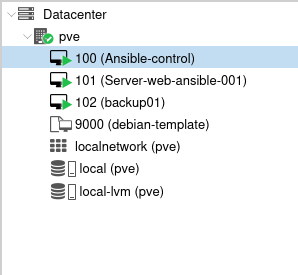
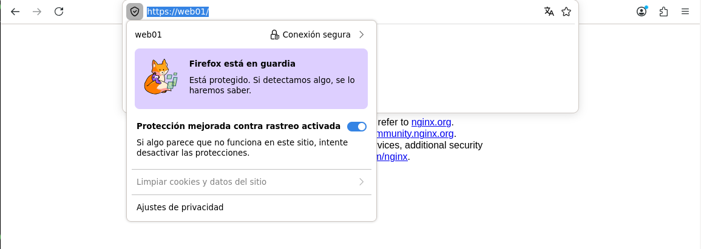
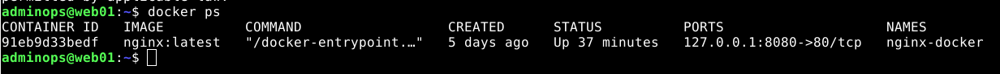
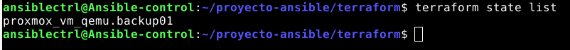
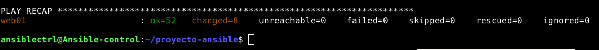

# Automatización y hardening de servidores Debian con Ansible

Proyecto de laboratorio orientado a la automatización de administración de sistemas Linux mediante **Ansible**, ampliado posteriormente con **Docker**, **Terraform + Proxmox** y un sistema remoto de copias de seguridad con **Restic**.

El objetivo principal es convertir la configuración de servidores Debian en código reproducible, modular e idempotente, evitando configuraciones manuales y facilitando el despliegue y mantenimiento de nuevos sistemas.

## Arquitectura

| Nodo | IP | Función |
|---|---|---|
| Ansible-control | 192.168.18.30 | Nodo de control Ansible y Terraform |
| web01 | 192.168.18.40 | Servidor web gestionado |
| backup01 | 192.168.18.50 | Servidor de copias de seguridad |
| Proxmox VE | 192.168.18.4 | Plataforma de virtualización |

```text
                    Proxmox VE
                   192.168.18.4
                         │
         ┌───────────────┼───────────────┐
         │               │               │
         ▼               ▼               ▼

 Ansible-control       web01          backup01
 192.168.18.30     192.168.18.40   192.168.18.50
      │                 │               │
      │                 ├─ Nginx        ├─ Restic
      │                 ├─ TLS/HTTPS    ├─ UFW
      │                 ├─ UFW          ├─ Fail2ban
      │                 ├─ Fail2ban     └─ SSH hardening
      │                 ├─ Docker
      │                 └─ Restic client
      │
      ├─ Ansible
      └─ Terraform
```



## Ansible como núcleo del proyecto

Ansible es la pieza principal del laboratorio. La configuración se organiza mediante roles independientes y reutilizables:

```text
roles/
├── base/
├── users/
├── sudo/
├── ssh/
├── firewall/
├── tls/
├── nginx/
├── fail2ban/
├── docker/
├── backup_server/
└── backup_client/
```

Los playbooks actúan como orquestadores y los roles contienen la lógica específica de cada funcionalidad.

## Configuración base

El rol `base` prepara un sistema Debian desde una instalación limpia:

- actualización de repositorios APT;
- actualización de paquetes;
- instalación de herramientas administrativas;
- configuración de hostname;
- zona horaria;
- Chrony;
- `/etc/hosts`.

## Gestión de usuarios y sudo

Ansible crea y configura:

- usuario administrativo;
- usuario estándar;
- directorios `.ssh`;
- claves públicas;
- permisos de `authorized_keys`;
- grupo `sudo`;
- configuración en `/etc/sudoers.d/`.

## Hardening SSH

La configuración SSH se gestiona mediante:

```text
/etc/ssh/sshd_config.d/99-hardening.conf
```

Configuración principal:

```text
PermitRootLogin no
PasswordAuthentication no
PubkeyAuthentication yes
AllowUsers adminops
```

## Firewall con UFW

Se utiliza UFW con política restrictiva:

```text
incoming: deny
outgoing: allow
```

En `web01` se permiten:

```text
22  SSH
80  HTTP
443 HTTPS
```

En `backup01`, el mismo rol se reutiliza con variables específicas para permitir únicamente SSH.

## Nginx y HTTPS

Ansible automatiza:

- instalación de Nginx;
- creación del document root;
- despliegue de contenido HTML;
- virtual host;
- desactivación del sitio por defecto;
- validación con `nginx -t`;
- gestión del servicio mediante handlers;
- redirección HTTP → HTTPS.



## TLS y CA propia

El laboratorio utiliza una CA propia para firmar el certificado de `web01`.

Se validó:

- creación de la CA;
- firma del certificado;
- SAN correcto;
- instalación de la CA en el sistema;
- instalación en Firefox;
- acceso HTTPS confiable sin advertencias.

## Fail2ban

Se integró Fail2ban como capa adicional de seguridad para SSH, validando detección de intentos fallidos y funcionamiento de la jail `sshd`.

## Docker y reverse proxy

El proyecto se amplió con Docker:

- Docker Engine;
- Docker Compose;
- contenedores de prueba;
- backend web;
- integración con Nginx como reverse proxy.

El contenedor se mantiene publicado únicamente en loopback (`127.0.0.1:8080`), quedando Nginx como punto de entrada.



## Terraform + Proxmox

Como ampliación del laboratorio se integró Terraform para automatizar el aprovisionamiento de infraestructura.

Terraform se ejecuta desde `Ansible-control` y se comunica con la API de Proxmox mediante un usuario y token dedicados.

El objetivo fue desplegar automáticamente `backup01` a partir de una plantilla Debian.

```text
Terraform
   │
   ▼
API Proxmox
   │
   ▼
debian-template
   │
   │ clone
   ▼
backup01
```



## Cloud-Init

Terraform entrega a Proxmox los parámetros iniciales y Cloud-Init los aplica durante el primer arranque:

- dirección IP;
- gateway;
- hostname;
- usuario inicial;
- clave SSH pública.

Después, Ansible toma el control del servidor.

## Configuración de backup01

Una vez creada con Terraform, `backup01` se configura mediante Ansible:

- configuración base;
- usuarios;
- sudo;
- SSH hardening;
- UFW;
- Fail2ban;
- usuario dedicado `restic`;
- directorio `/srv/restic`;
- repositorio `/srv/restic/web01`.

La separación de responsabilidades es:

```text
Terraform  → crea infraestructura
Cloud-Init → inicializa la VM
Ansible    → configura el sistema
```

## Backups con Restic

`web01` envía las copias a `backup01` mediante SSH/SFTP:

```text
web01
  │
  │ Restic + SSH/SFTP
  ▼
backup01
  │
  └── /srv/restic/web01
```

Se utiliza una clave SSH dedicada exclusivamente al backup.

## Ansible Vault

La contraseña del repositorio Restic no se almacena en texto plano. Se protege mediante **Ansible Vault**.

Durante la ejecución, Ansible genera en `web01`:

```text
/root/.config/restic/password
```

con permisos `0600`.

## Backup automático

Ansible genera:

```text
/usr/local/sbin/restic-backup.sh
```

y programa su ejecución mediante cron:

```text
0 2 * * * /usr/local/sbin/restic-backup.sh
```

Actualmente se realiza una copia de `/etc/nginx`.

## Restauración validada

No se consideró validado el sistema únicamente por crear snapshots. También se realizó una restauración real y se verificaron los archivos recuperados.


Flujo validado:

```text
BACKUP
  ↓
SNAPSHOT
  ↓
ALMACENAMIENTO REMOTO
  ↓
RESTORE
  ↓
VALIDACIÓN
```

## Idempotencia

Los playbooks pueden ejecutarse varias veces sin recrear recursos innecesariamente.

Ejemplo de ejecución correcta:

```text
ok=52
changed=8
unreachable=0
failed=0
```



## Tecnologías utilizadas

- Ansible
- Debian GNU/Linux
- SSH
- UFW
- Fail2ban
- Nginx
- TLS / OpenSSL
- Docker
- Docker Compose
- Terraform
- Proxmox VE
- Cloud-Init
- Restic
- Ansible Vault
- cron

## Conceptos trabajados

- Configuration Management
- Infrastructure as Code
- automatización de sistemas
- hardening Linux
- autenticación mediante claves SSH
- gestión de secretos
- firewall
- reverse proxy
- contenedores
- virtualización
- aprovisionamiento automático
- backups cifrados
- restauración
- idempotencia
- separación de responsabilidades

## Resultado

El resultado es un laboratorio donde la configuración del sistema, la seguridad y parte del aprovisionamiento de infraestructura están definidos como código.

El objetivo no ha sido únicamente hacer funcionar los servicios, sino construir una infraestructura **reproducible, modular, segura, documentada, reutilizable y fácilmente ampliable**.
